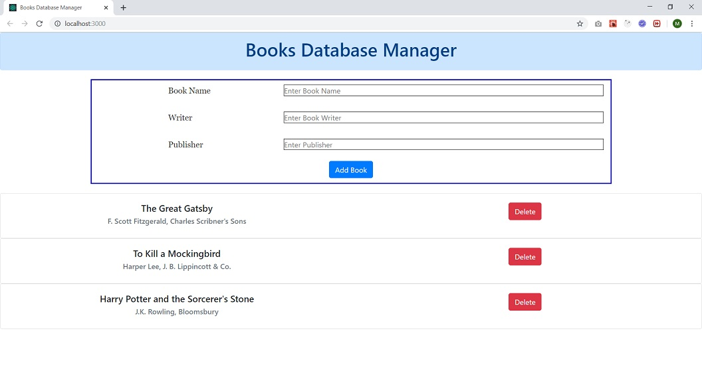

In this full stack web application; we manage a Mongo DB using Express.js (Node.js) at the back-end, and React (with Bootstrap CSS) at the front-end. Rest API used between front and back communication.



You should firstly run

```javascript
npm start
```

for the Node.js (node-restful-server), and then for the React (react-frontend).